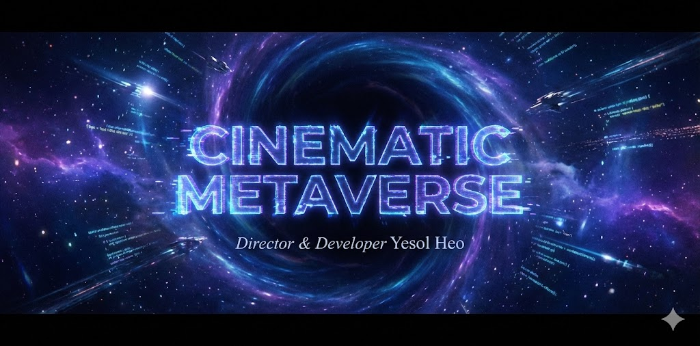

    

 

    

 

| **🛠️ MAIN STACK** | **🚀 EXPLIPCIT SKILLS** |
| :---: | :---: |
|     |     |

 

    <h2>📡 VOYAGE DATA</h2>

    
    

  

    
      
    <code>Last Login: Now from Universe-1537</code>

